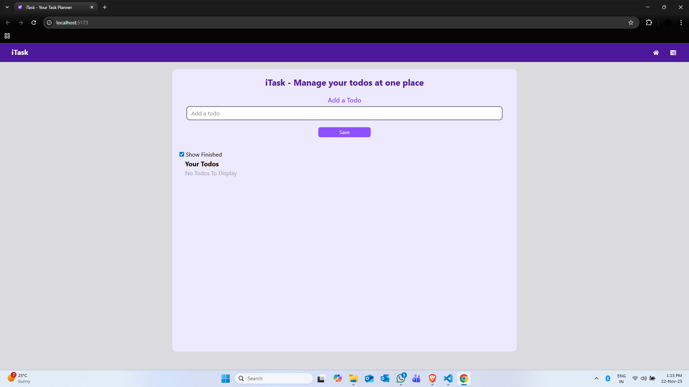
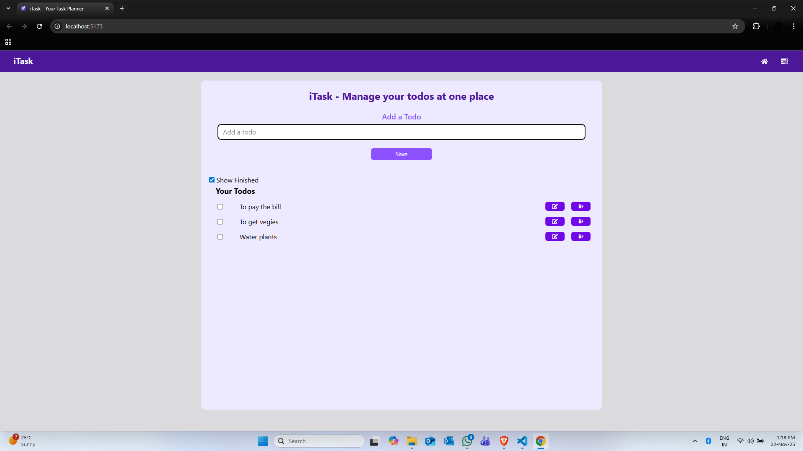
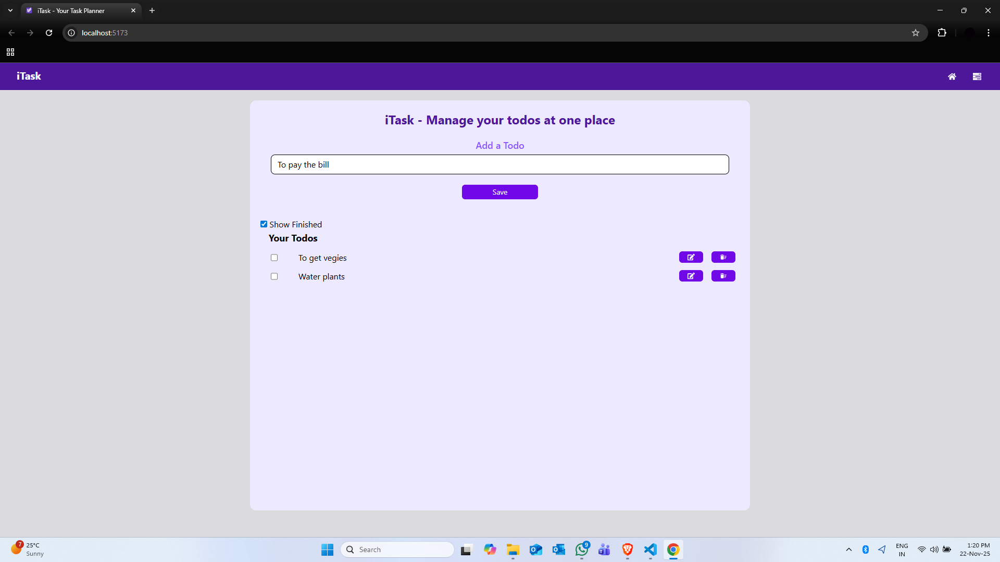
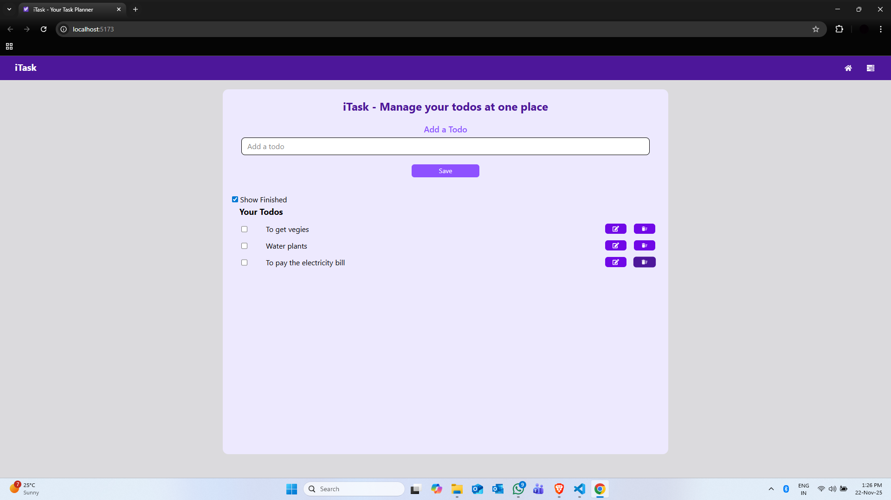
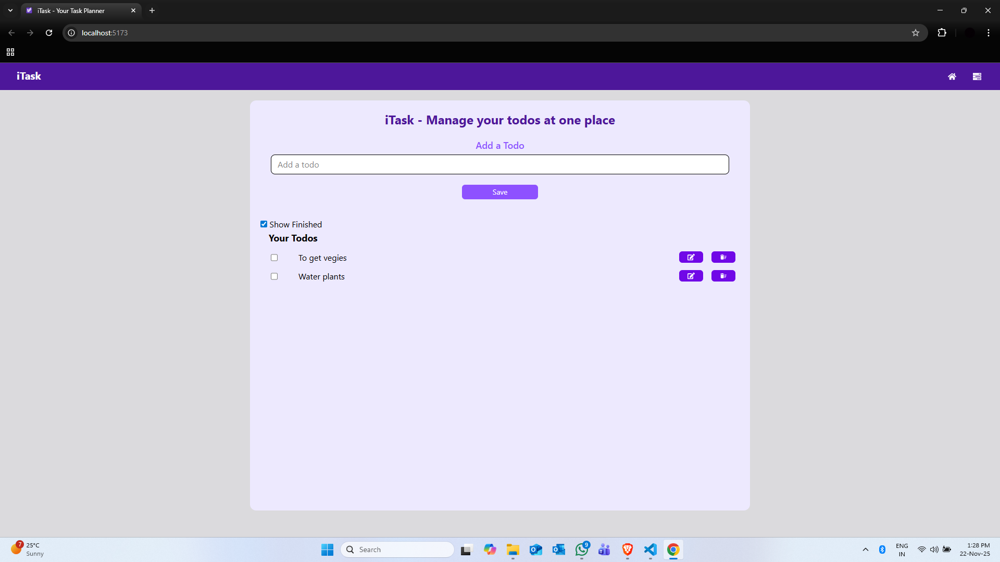
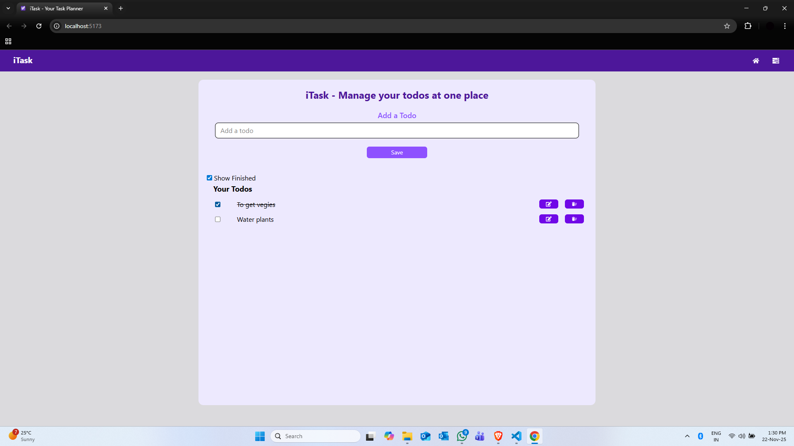
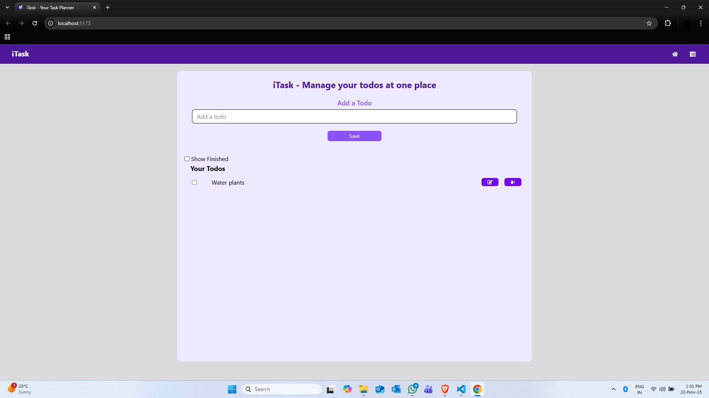

# iTask

Simple React todo app to add, edit, delete and mark tasks as finished. Todos are persisted to localStorage and animated with Framer Motion. UI uses Tailwind CSS and icons from react-icons.

## Features
- Add todos (input requires more than 3 characters).
   

   
   

- Edit a todo (loads text into the input for modification).
   

   
   
   
   

- Delete a todo.
   

   
   
   

- Mark todo as finished (checkbox).
   

   
   
   

- Toggle visibility of finished todos.
- Persists todos in browser localStorage.
- Small entry/exit animations using Framer Motion.

## How it works (high level)
- `App.jsx` holds state:
  - `todo` — current text in the input.
  - `todos` — array of todo objects ({ id, todo, isCompleted }).
  - `showFinished` — whether finished items are shown.
- Adding: `handleAdd` creates a new todo with `uuid` and updates state + localStorage.
- Editing: `handleEdit` populates the input with the selected todo text and removes the original item so the saved item will be replaced when you click Save.
- Deleting: `handleDelete` removes the item from state + localStorage.
- Toggling complete: checkbox flips `isCompleted` and updates localStorage.
- `Navbar.jsx` is a small header component with icons.
- Animations are implemented with `framer-motion` and icons via `react-icons`. Styling uses Tailwind utility classes.

## Files (important)
- `src/App.jsx` — main app and todo logic
- `src/components/Navbar.jsx` — header
- `package.json` — dependencies (React, framer-motion, uuid, react-icons, Tailwind CSS)

## Run locally
1. Install dependencies:
   - npm install
2. Start dev server:
   - npm start
3. Build for production:
   - npm run build

Todos persist in browser localStorage under the key `todos`. Deleting browser storage will remove saved todos.